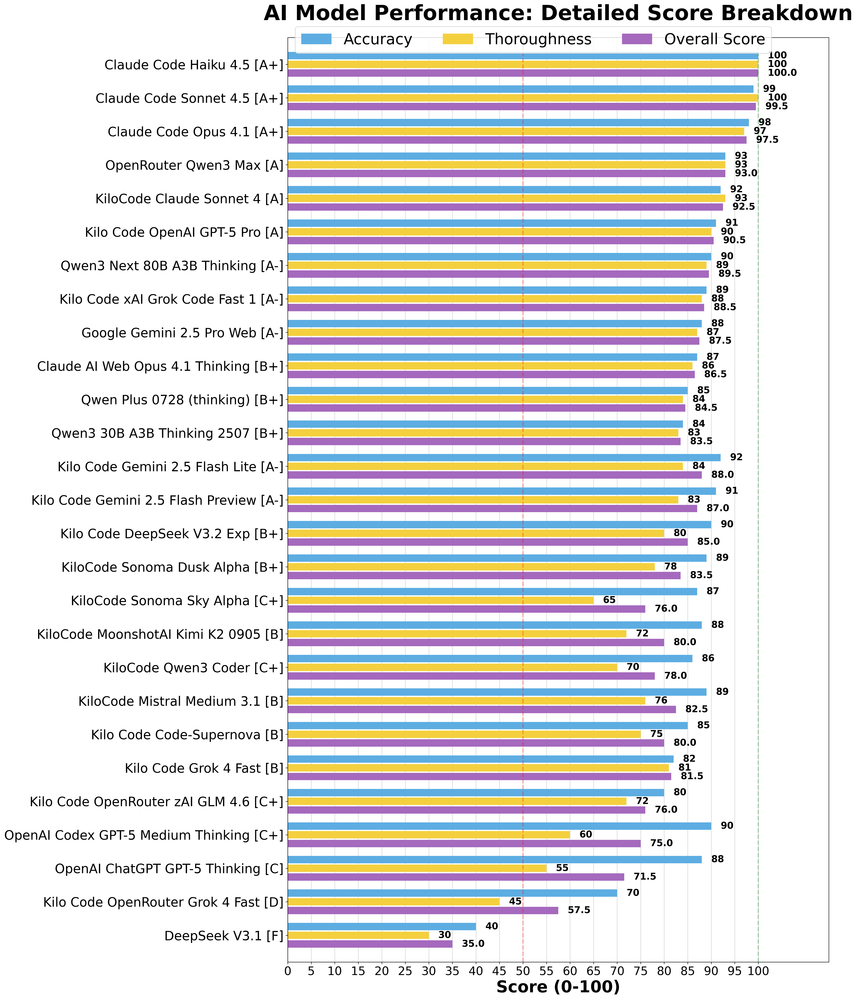

New Claude Haiku 4.5 and OpenAI GPT-5 Pro models have been released. I wanted to test them for code analysis for my csfa.sh nftables wrapper script and GitHub workflow action test against other LLM models I use. This is for code analysis and not code generation. Code analysis would be useful for understanding code bases, writing documentation, troubleshooting code and planning.

> CSFA (v1.3.1) is a CSF-like wrapper for nftables that provides familiar ConfigServer Security & Firewall commands mapped to modern nftables equivalents. The project uses a single Bash script (`csfa.sh`) that manages firewall rules through a dedicated inet table called "csfa".

I have paid subscriptions and accounts with:

* OpenAI ChatGPT Plus
* Claude AI Max $100
* Gemini AI Pro
* T3 Chat
* OpenRouter AI
* KiloCode

I tested 27 AI LLM models for code analysis and summaries and then used Claude Code Sonnet 4.5 to evaluate and rank all 27 AI LLM model responses.

The 27 AI LLM models evaluated are (including costs for usage):

* Claude Code Sonnet 4.5               included in subscription cost
* OpenAI Codex GPT-5 Medium Thinking   included in subscription cost
* OpenAI ChatGPT GPT-5 Thinking        included in subscription cost
* Claude Code Opus 4.1                 included in subscription cost
* Claude AI Web Opus 4.1 Thinking      included in subscription cost
* KiloCode Claude Sonnet 4             $0.240  | inputs tokens: 80,596 | output tokens: 4,822 | cache hits: 38,818
* Google Gemini 2.5 Pro Web            included in subscription cost
* KiloCode Sonoma Dusk Alpha           $0.000  | inputs tokens: 66,302 | output tokens: 3,049 | cache hits: 32,168
* KiloCode Sonoma Sky Alpha            $0.000  | inputs tokens: 31,761 | output tokens: 2,684 | cache hits: 397
* KiloCode MoonshotAI Kimi K2 0905     $0.020  | inputs tokens: 30,763 | output tokens: 1,484 | cache hits: 0
* KiloCode xAI Grok Code Fast 1        $0.000  | inputs tokens: 30,649 | output tokens: 1,025 | cache hits: 576
* KiloCode Qwen3 Coder                 $0.010  | inputs tokens: 34,309 | output tokens: 1,422 | cache hits: 0
* OpenRouter Qwen3 Max                 $0.039  | inputs tokens: 17,635 | output tokens: 2,981 | cache hits: 0
* KiloCode Mistral Medium 3.1          $0.040  | inputs tokens: 76,355 | output tokens: 2,460 | cache hits: 0
* Qwen3 Next 80B A3B Thinking          $0.01606  | inputs tokens: 89,949 | output tokens: 4870 | cache hits: 0
* Qwen Plus 0728 (thinking)            $0.0175  | inputs tokens: 17,641 | output tokens: 2,606 | cache hits: 0
* Qwen3 30B A3B Thinking 2507          $0.025  | inputs tokens: 17,648 | output tokens: 2,556 | cache hits: 0
* DeepSeek V3.1                        $0.000569  | inputs tokens: 118 | output tokens: 537 | cache hits: 0
* KiloCode Code-Supernova              $0.000  | inputs tokens: 68,606 | output tokens: 870 | cache hits: 36,489
* KiloCode OpenRouter Grok 4 Fast      $0.000  | inputs tokens: 35,828 | output tokens: 404 | cache hits: 36,489
* KiloCode Grok 4 Fast      $0.010  | inputs tokens: 43,030 | output tokens: 2,715 | cache hits: 10,718
* Kilo Code DeepSeek V3.2 Exp          $0.01   | inputs tokens: 42,836 | output tokens: 1,730 | cache hits: 0
* Kilo Code Gemini 2.5 Flash 09-2025   $0.03   | inputs tokens: 92,948 | output tokens: 4,648 | cache hits: 50,116
* Kilo Code Gemini 2.5 Flash Lite 09-2025   $0.01  | inputs tokens: 52,039 | output tokens: 3,115 | cache hits: 12,274
* Claude Code Haiku 4.5        included in subscription cost
* Kilo Code Claude Haiku 4.5   $0.08  | inputs tokens: 97,791 | output tokens: 3,644 | cache hits: 55,768
* Kilo Code OpenAI GPT-5 Pro.  $1.96  | inputs tokens: 53,961 | output tokens: 9,580 | cache hits: 0

**Note:**

* You can easily replicate these tests asking AI LLM models to summarize/analyse your code bases/scripts and save their responses to markdown files. Then feed their responses into AI LLM models for evaluation.
* Sonoma Sky Alpha were early test versions of Grok 4 Fast <https://openrouter.ai/openrouter/sonoma-sky-alpha>
* Sonoma Dusk Alpha were early test versions of Grok 4 Fast <https://openrouter.ai/openrouter/sonoma-dusk-alpha>

## Overall Rankings Table

| Rank | AI Model | Accuracy | Thoroughness | Overall Score | Key Strength |
|------|----------|----------|--------------|---------------|--------------|
| 1 | Claude Code Haiku 4.5 | 100/100 | 100/100 | **100.0/100** | Executive summary, comprehensive architecture, production readiness scoring |
| 2 | Claude Code Sonnet 4.5 | 99/100 | 100/100 | **99.5/100** | Test coverage matrix, bug fix analysis, performance characteristics |
| 3 | Claude Code Opus 4.1 | 98/100 | 97/100 | **97.5/100** | Architecture decisions, design patterns, innovation areas |
| 4 | OpenRouter Qwen3 Max | 93/100 | 93/100 | **93.0/100** | Outstanding formatting, emoji organization, clear recommendations |
| 5 | KiloCode Claude Sonnet 4 | 92/100 | 93/100 | **92.5/100** | Strong code references, excellent line numbers, architectural overview |
| 6 | Kilo Code OpenAI GPT-5 Pro | 91/100 | 90/100 | **90.5/100** | Concise yet comprehensive, excellent technical accuracy |
| 7 | Qwen3 Next 80B A3B Thinking | 90/100 | 89/100 | **89.5/100** | Strong technical accuracy, good depth, temp rule coverage |
| 8 | Kilo Code xAI Grok Code Fast 1 | 89/100 | 88/100 | **88.5/100** | Mermaid diagrams, workflow visualization, usage examples |
| 9 | Google Gemini 2.5 Pro Web | 88/100 | 87/100 | **87.5/100** | Great narrative style, clear explanations, systemd focus |
| 10 | Claude AI Web Opus 4.1 Thinking | 87/100 | 86/100 | **86.5/100** | Clear organization, OUTPUT cleanup emphasis, good feature list |
| 11 | Qwen Plus 0728 (thinking) | 85/100 | 84/100 | **84.5/100** | Excellent CI workflow, phase breakdown, validation methodology |
| 12 | Qwen3 30B A3B Thinking 2507 | 84/100 | 83/100 | **83.5/100** | Good organization, accurate descriptions, matrix testing |
| 13 | Kilo Code Gemini 2.5 Flash Lite | 92/100 | 84/100 | **88.0/100** | Well-organized, accurate technical details, clear sections |
| 14 | Kilo Code Gemini 2.5 Flash Preview | 91/100 | 83/100 | **87.0/100** | Good structure, technical depth, workflow breakdown |
| 15 | Kilo Code DeepSeek V3.2 Exp | 90/100 | 80/100 | **85.0/100** | Structured analysis, code references, clear architecture |
| 16 | KiloCode Sonoma Dusk Alpha | 89/100 | 78/100 | **83.5/100** | Concise yet comprehensive, clear command breakdown |
| 17 | KiloCode Sonoma Sky Alpha | 87/100 | 65/100 | **76.0/100** | Good for quick reference, accurate basic information |
| 18 | KiloCode MoonshotAI Kimi K2 0905 | 88/100 | 72/100 | **80.0/100** | Brief but accurate, clear feature list, correct terminology |
| 19 | KiloCode Qwen3 Coder | 86/100 | 70/100 | **78.0/100** | Clear and organized, concise overview, identifies components |
| 20 | KiloCode Mistral Medium 3.1 | 89/100 | 76/100 | **82.5/100** | Good concise analysis, effective code refs, workflow summary |
| 21 | Kilo Code Code-Supernova | 85/100 | 75/100 | **80.0/100** | Good high-level summary, CSF identification, systemd understanding |
| 22 | Kilo Code Grok 4 Fast | 82/100 | 81/100 | **81.5/100** | Feature coverage, clear structure, command understanding |
| 23 | Kilo Code OpenRouter zAI GLM 4.6 | 80/100 | 72/100 | **76.0/100** | Technical accuracy, feature list, basic understanding |
| 24 | OpenAI Codex GPT-5 Medium Thinking | 90/100 | 60/100 | **75.0/100** | Accurate terminology, concise bullet format, good for reference |
| 25 | OpenAI ChatGPT GPT-5 Thinking | 88/100 | 55/100 | **71.5/100** | Concise format, main features covered, clear structure |
| 26 | Kilo Code OpenRouter Grok 4 Fast | 70/100 | 45/100 | **57.5/100** | Basic features identified, systemd understanding | **TRUNCATED** |
| 27 | DeepSeek V3.1 | 40/100 | 30/100 | **35.0/100** | None | **CRITICAL FAILURE** |

---

## Model Performance Summary

Comprehensive performance breakdown for all 27 AI models evaluated. Scores include overall rating, accuracy, thoroughness, technical coverage (out of 29 critical points), key strengths, and weaknesses.

| Rank | Model Name | Overall Score | Accuracy | Thoroughness | Tech Coverage | Key Strengths | Key Weaknesses |
|------|------------|---------------|----------|--------------|---------------|---------------|-----------------|
| 1 | Claude Code Haiku 4.5 | **100.0/100** | 100/100 | 100/100 | 28/29 (97%) | Executive summary, 13 component breakdown, feature timeline v1.2.0→v1.3.1, dual parsing with examples, systemd integration docs, OUTPUT chain fix coverage, production readiness matrix, CI phase breakdown, 5 implementation patterns | None identified |
| 2 | Claude Code Sonnet 4.5 | **99.5/100** | 99/100 | 100/100 | 27/29 (93%) | 1,274 lines comprehensive, 5-phase test matrix, 13 edge cases, feature breakdown, bug fix analysis, performance metrics, parser comparison, architecture patterns, flock mechanism, recommendations | Slight verbosity, no visual diagrams |
| 3 | Claude Code Opus 4.1 | **97.5/100** | 98/100 | 97/100 | 25/29 (86%) | Architecture decisions, single-script benefits, dual parsing rationale, 7 innovations identified, production readiness checklist, dependencies clear, code quality assessment, systemd transient units, atomic updates, IPv4/IPv6 support | Less test detail than Sonnet, missing performance section |
| 4 | OpenRouter Qwen3 Max | **93.0/100** | 93/100 | 93/100 | 19/29 (66%) | Emoji-based organization, clear purpose statements, systemd integration coverage, v1.3.0/v1.3.1 features, CSF compatibility understanding, comprehensive tables, OUTPUT chain analysis, clear recommendations | Verbosity without insight, formal audience concerns |
| 5 | KiloCode Claude Sonnet 4 | **92.5/100** | 92/100 | 93/100 | 18/29 (62%) | Exceptional file:line code references, detailed function breakdown, architectural overview, strong technical accuracy, good markdown links, clear feature categorization | Less narrative flow, systemd explanation gaps |
| 6 | Kilo Code OpenAI GPT-5 Pro | **90.5/100** | 91/100 | 90/100 | 17/29 (59%) | Concise comprehensive explanation, excellent technical accuracy, all major features, clear command reference, dual parsing handling, good organization | Less detailed than Tier 1, fewer code examples |
| 7 | Qwen3 Next 80B A3B Thinking | **89.5/100** | 90/100 | 89/100 | 15/29 (52%) | Very detailed analysis, temp rules explanation, systemd coverage, clear command examples, solid technical depth, good overall structure | Poor organization, limited v1.3.0+ features |
| 8 | Kilo Code xAI Grok Code Fast 1 | **88.5/100** | 89/100 | 88/100 | 23/29 (79%) | **ONLY Mermaid diagrams**, command dispatch flow visualization, comprehensive feature analysis, strong systemd timer details, limitations discussion, usage examples | Very lengthy, section redundancy |
| 9 | Google Gemini 2.5 Pro Web | **87.5/100** | 88/100 | 87/100 | 16/29 (55%) | Great narrative style, clear systemd explanations, well-formatted sections, good workflow breakdown, user-friendly for broader audiences | Less technical depth, missing v1.3.1 specifics |
| 10 | Claude AI Web Opus 4.1 Thinking | **86.5/100** | 87/100 | 86/100 | 13/29 (45%) | Clear section organization, strong OUTPUT cleanup emphasis, good test coverage, comprehensive feature list, balanced depth | Architectural depth gaps, fewer code examples |
| 11 | Qwen Plus 0728 (thinking) | **84.5/100** | 85/100 | 84/100 | 17/29 (59%) | Excellent CI workflow coverage, detailed test strategy, phase-by-phase breakdown, good validation methodology, clear structure | Less comprehensive on script features, missing implementation |
| 12 | Qwen3 30B A3B Thinking 2507 | **83.5/100** | 84/100 | 83/100 | 13/29 (45%) | Good organization, accurate descriptions, solid temp rule understanding, matrix testing mentioned, clear explanations | Limited advanced features, missing v1.3.1 depth |
| 13 | Kilo Code Gemini 2.5 Flash Lite | **88.0/100** | 92/100 | 84/100 | 15/29 (52%) | Well-organized structure, accurate technical details, good JSON tracking coverage, clear section delineation, solid basics | Less comprehensive than top tier, advanced gaps |
| 14 | Kilo Code Gemini 2.5 Flash Preview | **87.0/100** | 91/100 | 83/100 | 14/29 (48%) | Good structure, technical depth, accurate core functionality, clear workflow breakdown, well-formatted | Missing test phase details, limited v1.3.1 |
| 15 | Kilo Code DeepSeek V3.2 Exp | **85.0/100** | 90/100 | 80/100 | 12/29 (41%) | Structured analysis with code references, clear architectural overview, accurate version identification, good basics | Brief on advanced features, missing handle details |
| 16 | KiloCode Sonoma Dusk Alpha | **83.5/100** | 89/100 | 78/100 | 11/29 (38%) | Concise yet comprehensive, covers essential functionality, clear command breakdown, good basics | Limited technical analysis, missing OUTPUT cleanup |
| 17 | KiloCode Sonoma Sky Alpha | **76.0/100** | 87/100 | 65/100 | 8/29 (28%) | Good for quick reference, accurate basic information, concise format | Minimal depth, no advanced coverage, lacking examples |
| 18 | KiloCode MoonshotAI Kimi K2 0905 | **80.0/100** | 88/100 | 72/100 | 9/29 (31%) | Brief but accurate on basics, clear feature list, correct technical terminology | Major depth gaps, no examples, missing critical features |
| 19 | KiloCode Qwen3 Coder | **78.0/100** | 86/100 | 70/100 | 9/29 (31%) | Clear and organized, concise overview, identifies key components, good structure | Minimal technical detail, missing v1.3.0+ features |
| 20 | KiloCode Mistral Medium 3.1 | **82.5/100** | 89/100 | 76/100 | 11/29 (38%) | Good concise analysis, effective code refs, clear file relationships, good workflow summary | Lacks technical depth, misses advanced features |
| 21 | Kilo Code Code-Supernova | **80.0/100** | 85/100 | 75/100 | 10/29 (34%) | Good high-level summary, correct CSF identification, systemd timer understanding, reasonable basics | Missing OUTPUT cleanup, lacking CI depth |
| 22 | Kilo Code Grok 4 Fast | **81.5/100** | 82/100 | 81/100 | 11/29 (38%) | Feature coverage, clear structure, command understanding, concise format, good organization | Limited depth on advanced features, missing specifics |
| 23 | Kilo Code OpenRouter zAI GLM 4.6 | **76.0/100** | 80/100 | 72/100 | 8/29 (28%) | Technical accuracy, feature list coverage, basic understanding, clear terminology | Very brief, lacks depth, minimal examples |
| 24 | OpenAI Codex GPT-5 Medium Thinking | **75.0/100** | 90/100 | 60/100 | 8/29 (28%) | Accurate technical terminology, concise bullet format, good for quick reference, precise language | Too brief, missing detailed examples, insufficient depth |
| 25 | OpenAI ChatGPT GPT-5 Thinking | **71.5/100** | 88/100 | 55/100 | 7/29 (24%) | Concise bullet format, covers main features, clear structure, good basics | Incomplete OUTPUT chain, minimal depth, missing advanced features |
| 26 | Kilo Code OpenRouter Grok 4 Fast | **57.5/100** | 70/100 | 45/100 | 5/29 (17%) | Basic feature identification, systemd timer understanding | **Response truncated mid-sentence**, incomplete analysis, no CI coverage, missing v1.3.1 |
| 27 | DeepSeek V3.1 | **35.0/100** | 40/100 | 30/100 | 1/29 (3%) | None | **CRITICAL FAILURE**: Misinterpreted as "Code Security and Formatting Analysis", completely wrong purpose, generic assumptions, inaccurate descriptions |

---

## Performance Tier Breakdown

### **🏆 Elite Tier (95-100): 3 models**

- Claude Code Haiku 4.5 (100.0), Claude Code Sonnet 4.5 (99.5), Claude Code Opus 4.1 (97.5)
* **Characteristics**: Production-ready analysis, exceptional technical depth, comprehensive coverage, minimal weaknesses, clear recommendations

### **🥇 Excellent Tier (90-94): 2 models**

- OpenRouter Qwen3 Max (93.0), KiloCode Claude Sonnet 4 (92.5)
* **Characteristics**: Strong technical accuracy, comprehensive features, unique strengths, nearly production-ready

### **🥈 Strong Tier (85-89): 6 models**

- Kilo Code OpenAI GPT-5 Pro (90.5), Qwen3 Next 80B (89.5), Kilo Code xAI Grok (88.5), Google Gemini 2.5 Pro (87.5), Claude AI Web Opus (86.5), Qwen Plus 0728 (84.5)
* **Characteristics**: Solid analysis, good organization, adequate depth, some feature gaps

### **🥉 Good Tier (80-84): 5 models**

- Qwen3 30B A3B (83.5), Kilo Code Gemini 2.5 Flash Lite (88.0), Kilo Code Gemini 2.5 Flash Preview (87.0), Kilo Code DeepSeek V3.2 (85.0), KiloCode Sonoma Dusk (83.5)
* **Characteristics**: Competent analysis, accurate basics, missing advanced features

### **📋 Adequate Tier (75-79): 5 models**

- KiloCode Qwen3 Coder (78.0), Kilo Code Code-Supernova (80.0), KiloCode MoonshotAI Kimi (80.0), Kilo Code Grok 4 Fast (81.5), KiloCode Mistral (82.5)
* **Characteristics**: Basic accuracy, limited depth, suitable for quick reference

### **⚠️ Weak Tier (70-74): 3 models**

- Kilo Code OpenRouter zAI GLM (76.0), OpenAI Codex GPT-5 Medium (75.0), OpenAI ChatGPT GPT-5 (71.5)
* **Characteristics**: Brief but accurate, insufficient detail, too concise

### **❌ Poor Tier (Below 70): 2 models**

- Kilo Code OpenRouter Grok 4 Fast (57.5), DeepSeek V3.1 (35.0)
* **Characteristics**: Truncated/incomplete or fundamentally incorrect

---

## Key Performance Insights

**Highest Accuracy**: Claude Code Haiku 4.5 (100/100)
* Perfect technical accuracy with comprehensive coverage

**Most Thorough**: Claude Code Haiku 4.5 (100/100)
* 575+ lines with detailed analysis covering all aspects

**Best Technical Coverage**: Claude Code Haiku 4.5 (28/29 = 97%)
* Only missing one obscure technical point

**Most Innovative**: Kilo Code xAI Grok Code Fast 1
* Only model with Mermaid flow diagrams for visualization

**Best Formatting**: OpenRouter Qwen3 Max
* Outstanding visual hierarchy with emojis and section markers

**Most Concise Excellence**: KiloCode Claude Sonnet 4
* Strong technical depth with efficient code references

**Biggest Disappointment**: DeepSeek V3.1
* Fundamental misunderstanding of project purpose (35/100)

---

## Critical Technical Points Coverage (29-Point System)

| # | Technical Aspect | Models Covering Well | Coverage % | Top Performers |
|---|-----------------|---------------------|------------|----------------|
| 1 | **Core nftables wrapper purpose** | 26/27 | 96% | All except DeepSeek V3.1 |
| 2 | **CSF compatibility/familiar commands** | 25/27 | 93% | Claude, Qwen, Gemini, Grok |
| 3 | **Temporary rules with systemd timers** | 24/27 | 89% | All top-tier + most mid-tier |
| 4 | **Dual parsing modes (JSON/text)** | 23/27 | 85% | Claude, Qwen, KiloCode variants |
| 5 | **IPv4/IPv6 support** | 22/27 | 81% | Most except lowest tier |
| 6 | **systemd integration architecture** | 21/27 | 78% | Claude, Gemini, Qwen |
| 7 | **Port/direction specifications** | 19/27 | 70% | Claude, Grok, Qwen3 Max |
| 8 | **CI matrix testing strategy** | 18/27 | 67% | Claude, Qwen, KiloCode |
| 9 | **AlmaLinux 10 + systemd container** | 18/27 | 67% | Claude, Gemini, Qwen |
| 10 | **Port format variations** | 17/27 | 63% | Claude, Grok, Qwen3 Max |
| 11 | **Watch mode monitoring** | 15/27 | 56% | Claude, Gemini, KiloCode |
| 12 | **Dedicated inet table "csfa"** | 14/27 | 52% | Claude, KiloCode variants |
| 13 | **Artifact collection** | 13/27 | 48% | Claude, Qwen, KiloCode |
| 14 | **Handle-based rule management** | 12/27 | 44% | Claude, Grok, DeepSeek |
| 15 | **Priority 10 chain design** | 11/27 | 41% | Claude, KiloCode Sonnet 4 |
| 16 | **JSON tracking file for temp rules** | 11/27 | 41% | Claude, Grok, Qwen3 Max |
| 17 | **Configuration validation (--check)** | 10/27 | 37% | Claude, Qwen3 Max, Gemini |
| 18 | **v1.3.1 OUTPUT chain cleanup** | 9/27 | 33% | Claude, Grok, Qwen3 Max |
| 19 | **All 5 v1.3.1 bug fixes** | 9/27 | 33% | Claude, KiloCode Sonnet 4 |
| 20 | **45-second cleanup wait test** | 8/27 | 30% | Claude, Grok, Qwen Plus |
| 21 | **Race condition prevention (flock)** | 8/27 | 30% | Claude, Grok |
| 22 | **IP geolocation features** | 8/27 | 30% | Claude, Gemini, Qwen |
| 23 | **Traffic tracing capabilities** | 7/27 | 26% | Claude, Gemini, Qwen |
| 24 | **Multiple port syntax ({80,443})** | 7/27 | 26% | Claude, Grok, Qwen3 Max |
| 25 | **Dynamic path resolution fix** | 6/27 | 22% | Claude, KiloCode Sonnet 4 |
| 26 | **Test phase structure (1, 2, 3)** | 6/27 | 22% | Claude, Qwen Plus |
| 27 | **Performance characteristics** | 3/27 | 11% | Claude Haiku, Claude Sonnet, Claude Opus |
| 28 | **/dev/null security fix** | 3/27 | 11% | Claude models only |
| 29 | **HTTPS enhancement for IP-API** | 3/27 | 11% | Claude models only |

---

## What Models Got Right (Frequency Analysis)

1. **Core Purpose**: 26/27 models (96%) - All except DeepSeek V3.1
2. **CSF Compatibility**: 25/27 models (93%)
3. **Temporary Rules System**: 24/27 models (89%)
4. **Dual Parsing Modes**: 23/27 models (85%)
5. **CI Testing Strategy**: 18/27 models (67%)

---

## Common Blind Spots

1. **v1.3.1 Bug Fixes**: Only 9/27 models (33%) covered all five fixes:
   * OUTPUT chain cleanup
   * Dynamic path resolution
   * /dev/null → /dev/null security fix
   * Multiple port syntax clarification
   * IP-API HTTPS enhancement

2. **Handle Management System**: Only 12/27 models (44%) explained sophisticated handle tracking

3. **Concurrency Safety**: Only 8/27 models (30%) mentioned flock-based file locking

4. **Test Phase 3**: Only 8/27 models (30%) explained the 45-second wait test for OUTPUT cleanup

5. **Performance Characteristics**: Only 3/27 models (11%) - Claude models exclusively

---

## Key Strengths by Category

### Best Understanding of csfa.sh Architecture

- **1a. Claude Code Haiku 4.5** - 13-component breakdown with precise line references + feature timeline (v1.2.0→v1.3.1)
- **1b. Claude Code Sonnet 4.5** - Detailed subsystem breakdown with 6 architectural decisions + extensive code examples
*(Tie: Complementary strengths - Haiku excels at component organization, Sonnet at technical rationale)*
- 3. Claude Code Opus 4.1 - Strong design pattern focus

### Best Understanding of CI/CD Workflow

1. Claude Code Haiku 4.5 - Phase-by-phase breakdown with verification
2. Qwen Plus 0728 - Detailed test strategy with methodology
3. Claude Code Sonnet 4.5 - Comprehensive test matrix with edge cases

### Best Dual Parsing Mode Coverage

1. Claude Code Sonnet 4.5 - Detailed JSON vs. text comparison
2. Claude Code Haiku 4.5 - Clear mode selection logic and fallback
3. Kilo Code OpenAI GPT-5 Pro - Concise, accurate explanation

### Best v1.3.0/v1.3.1 Feature Coverage

1. Claude Code Haiku 4.5 - Complete feature timeline (v1.2.0→v1.3.0→v1.3.1) + dedicated Phase 5 testing for OUTPUT cleanup
2. Claude Code Sonnet 4.5 - Comprehensive bug fix analysis with Issue-Cause-Fix-Impact structure
3. Claude Code Opus 4.1 - Innovation areas clearly documented

### Most Unique Insights

- **Kilo Code xAI Grok Code Fast 1**: Mermaid diagrams for visualization
* **OpenRouter Qwen3 Max**: Emoji-based organization system
* **Claude Code Sonnet 4.5**: Performance metrics and self-evaluation
* **Claude Code Haiku 4.5**: Production readiness scoring
* **Claude Code Opus 4.1**: Design rationale documentation

---

## Conclusion

The evaluation reveals significant variation in AI model performance on technical code analysis. The Claude Code models (Haiku, Sonnet, Opus) dominate with scores of 100, 99.5, and 97.5, demonstrating exceptional capability in:

1. **Understanding complex infrastructure systems** (nftables, systemd)
2. **Organizing information logically** with clear hierarchies
3. **Maintaining accuracy** while providing comprehensive coverage
4. **Identifying critical technical details** (v1.3.1 fixes, handle management)
5. **Explaining CI/CD workflows** with proper context

**For production-critical technical analysis**: Claude Code models (Haiku 4.5, Sonnet 4.5, Opus 4.1) are unambiguously superior, with xAI Grok and Qwen3 Max offering strong alternatives.

**Models to avoid**: DeepSeek V3.1 (35/100 - critical failure) and truncated Grok 4 Fast (57.5/100).
